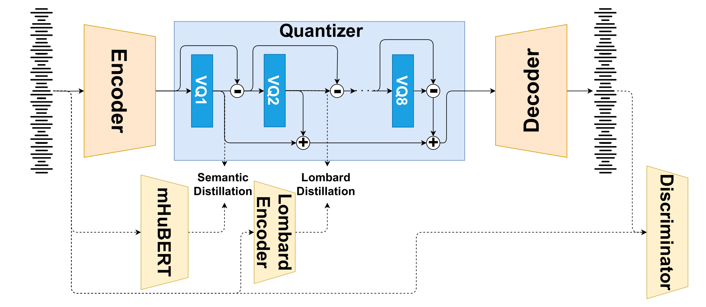

# LombardTokenizer: Disentanglement and Control of the Vocal Effort in a  Neural Speech Codec

<a href='https://lombardtokenizer.github.io/lombardtokenizer.github.io-main/'></a> 

## Abstract
Disentangling distinct types of information in speech representations is crucial for improving speech synthesis 
and voice conversion systems. In this work, we introduce LombardTokenizer, a neural speech codec able to separate 
features related to the vocal effort from other acoustic (and semantic) information. This model is built on 
SpeechTokenizer, a model proposed in the literature based on multi-stage quantization, which focused on isolating 
semantic content in its first quantization layer. We show that the level of vocal effort can be effectively captured 
in the second quantization layer by conditioning the quantization layer with neural encoders trained to represent 
the vocal effort. Experimental results demonstrate that the proposed method significantly outperforms existing 
methods in neutral-to-Lombard speech conversion while maintaining excellent speech synthesis quality, offering 
improved control over vocal effort and naturalness of synthesized speech.

<br>
<p align="center">
     <br>
    Overview
</p>
<br>

## Quick Link
* [Release](#release)
* [Samples](#samples)
* [Installation](#installation)
* [Model List](#model-list)
* [Usage](#usage)
* [Train LombardTokenizer](#train-lombardtokenizer)
    * [Data Preprocess](#data-preprocess)
    * [Train](#train)
    * [Inference](#inference)
* [Citation](#citation)
* [License](#license)

## Releases
- [2025/02/19] We released samples from the evaluation of LombardTokenizer.
- [Planned] Released the codes to train LombardTokenizer, the checkpoints used in the paper and the new dataset FLombard

## Samples
[LombardTokenizer](https://lombardtokenizer.github.io/lombardtokenizer.github.io/)

## Installation
Requirements:
* Python >= 3.9
* PyTorch v2.5.1
* Torchaudio v2.5.1
* Install dependencies
    ```bash
    git clone 
    cd LombardTokenizer
    pip install -r requirements.txt
    ```

## Data List
| Dataset | Usage |Description|
|:----|:----:|:----|
|[LibriSpeech-Train-360](https://www.danielpovey.com/files/2015_icassp_librispeech.pdf)|Training|Corpus of approximately 360 hours of 16kHz read English speech from [OpenSLR](https://www.openslr.org/12/)|
|[Avid](https://www.sciencedirect.com/science/article/pii/S0167639324000116)|Fine-tuning|Calibrated speech recordings produced by 50 speakers in four intensity categories from [Zenodo](https://zenodo.org/records/7948300)|
|[FLombard]()|Zero-shot evaluation|Newly collected dataset featuring 38 French speakers producing Lombard speech|

## Model List
| Model| Dataset |Description|
|:----|:----:|:----|
|[HuBERT](https://arxiv.org/pdf/2106.07447)|None|Pre-trained model from [HugginFace](https://huggingface.co/facebook/hubert-base-ls960)|
|[mHuBERT](https://arxiv.org/pdf/2406.06371)|None|Pre-trained model from [HugginFace](https://huggingface.co/utter-project/mHuBERT-147)|
|[FreeVC](https://arxiv.org/pdf/2210.15418)|Avid|Pre-trained model from [HugginFace](https://huggingface.co/spaces/OlaWod/FreeVC/tree/main)|
|[EnCodec](https://arxiv.org/pdf/2210.13438)|LibriSpeech and Avid|Implementation of EnCodec following [AcademiCodec](https://github.com/yangdongchao/AcademiCodec/tree/master?tab=readme-ov-file)|
|[SpeechTokenizer](https://arxiv.org/pdf/2308.16692)|LibriSpeech and Avid|Implementation of SpeechTokenizer following [SpeechTokenizer](https://github.com/ZhangXInFD/SpeechTokenizer/tree/main)|
|[LombardTokenzer_lomb-1]()|LibriSpeech and Avid|Regularised with the d-vector-based encoder|
|[LombardTokenzer_lomb-2]()|LibriSpeech and Avid|Regularised with the intensity predictor|

## Usage
To be added

## Train LombardTokenizer
To be added

### Data Preprocess
To be added

### Train
To be added

### Inference
To be added

## Acknowledgements
This implementation uses parts of the code from the following Github repos:
- [SpeechTokenizer](https://github.com/ZhangXInFD/SpeechTokenizer/tree/main)
- [AcademiCodec](https://github.com/yangdongchao/AcademiCodec/tree/master?tab=readme-ov-file)
- [FreeVC](https://github.com/OlaWod/FreeVC)

## Citation
To be added

## License
The code in this repository is released under the Creative Commons Zero v1.0 Universal license as found in the
[LICENSE](LICENSE) file.    